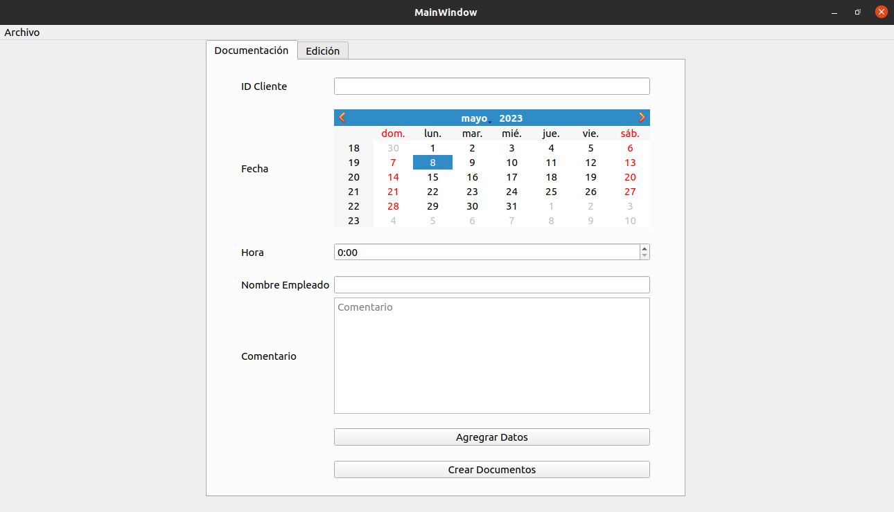
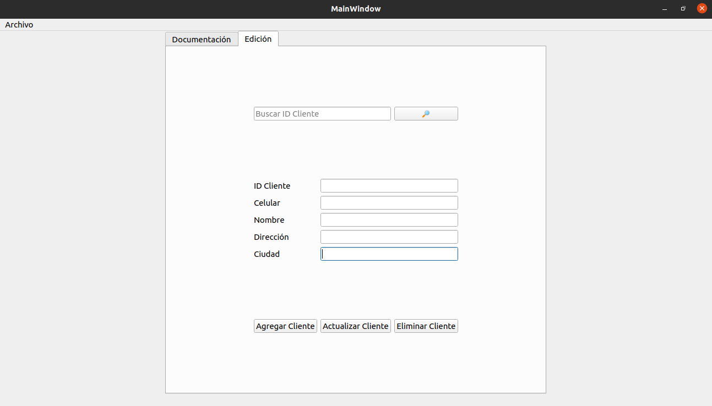
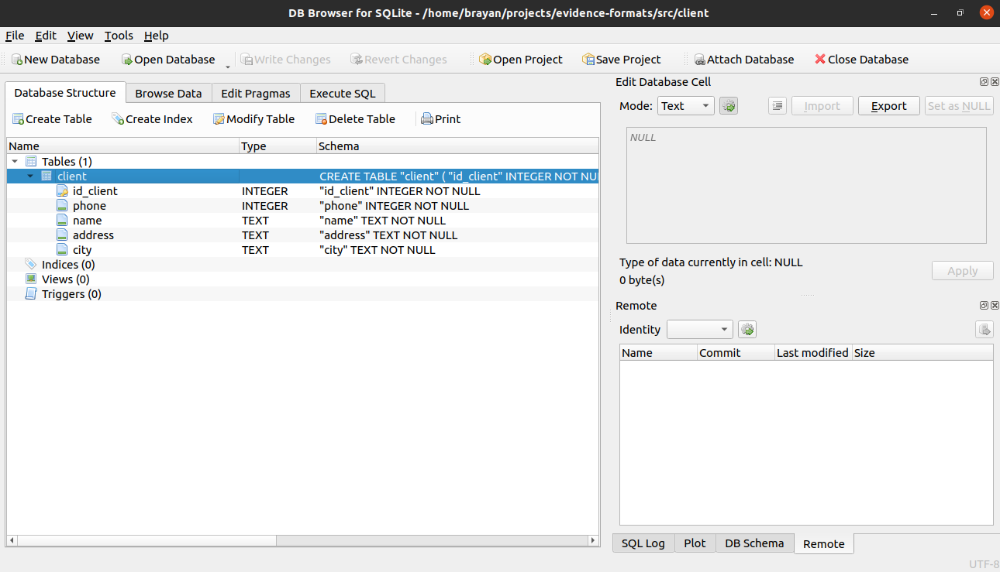

# Evidence Formats
## Descripción

Este proyecto consiste en agilizar el proceso de la creación de los archivos que sirven como evidencia para las llamadas que se gestionan en una empresa. Los lenguajes que se utilizan en este proyecto son Python y su herramienta PyQt5 para facilitar la interacción del usuario junto con el gestor de base de datos SQLite. 

## Instalación

### Instalación PyQt5 (Ubuntu)

``sudo apt install python3-pyqt5``

### Instalación Qt Designer (Ubuntu)

``sudo apt-get install qttools5-dev-tools``

## Creación de interfaz

Con la herramienta Qt Designer se diseña la siguiente interfaz gráfica (HMI): 

Los empleados apoyados de la interfaz pueden optimizar la documentación de los procesos relacionados a las llamadas que realizan para contactar a sus clientes (que presentan inconvenientes en su servicio), el proceso para registrar los datos de una llamada son los siguientes:

1. Digitar el ID del cliente.
2. Seleccionar la fecha en la que se realizó la llamada.
3. Digitar la hora en que se realizó la llamada.
4. Escibir el nombre del empleado (Responsable de relizar la llamada).
5. Ingresar el comentario relacionado a la llamada.
6. Tomar la captura de pantalla donde se evidencia la llamada y guardarla en la carpeta ``capture``, con el nombre ``<ID_Cliente>.png``.
7. Dar clic en "Agregar Datos", la aplicación se encarga de realizar la búsqueda del cliente por el ID Cliente en la base de datos, si no lo encuentra notifica al empleado de la advertencia.
8. Cuando se terminen de agregar todos los datos de cada una de las llamadas realizadas por el empleado, se debe dar clic en el botón "Crear Documentos", la aplicación se encarga de cada llamada capturar los datos relacionados al cliente como el nombre, celular, dirección y ciudad con los respectivos datos de la llamada pertinente como captura de pantalla, fecha y hora, con el fin de generar el documento que evidencia dichas llamadas.

## Creación base de datos (SQLite)

Para la empresa es indispensable la siguiente información: identificador del cliente, nombre, celular, dirección y la ciudad en la que reside, para almacenar esta información es necesario usar SQLite, se crea la tabla como se ve en la siguiente imagen:

## Inconvenientes

* Se presento error al insertar un registro en la base de datos, se evidenció que se presentaba ya que al momento de insertar se tenia la base de datos abierta.
